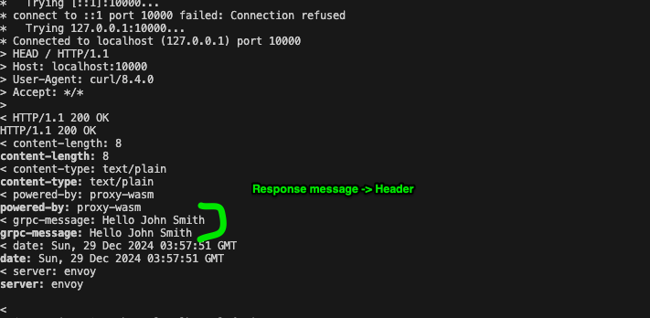

## Proxy-Wasm plugin - Test with Kind 

Proxy-Wasm plugin that logs HTTP Call out (Dispatch call) request/response headers.

### Building

```sh
cargo init --lib grpc-call-envoy  

$ cargo build --target wasm32-wasip1 --release

func-e run -c config-grpc-call.yaml (If you have func-e tool)

curl localhost:10000 -vvv --head
-- 
The other option is to run with the docker-compose (TODO)

--
docker build -t localhost:5001/wasm:v5http . --push

Go to /Users/rajramalingam/k8s-workout/Networking-and-Kubernetes/istio-1.24.1/wasm-extension 
apply-- wasm-plugin4.yaml


```


````

⏺ ✅ Memory Leak Detection with stats_alloc Successfully Implemented!

  🚀 What Was Added:

  1. Optional Memory Tracking Feature:
  # Enable with: cargo build --features memory-tracking
  [features]
  memory-tracking = ["stats_alloc"]

  2. Global Allocator Instrumentation:
  #[cfg(feature = "memory-tracking")]
  #[global_allocator]
  static GLOBAL: &StatsAlloc<System> = &INSTRUMENTED_SYSTEM;

  3. Comprehensive Memory Tracking Points:
  - Plugin Initialization - Baseline memory state
  - Request Start - Memory state at request beginning
  - After Header Processing - Memory after HashMap operations
  - After Protobuf Creation - Memory after serialization
  - gRPC Response Start - Memory when response received
  - Request End - Final memory state + leak detection

  📊 Memory Tracking Output Example:

  [MEMORY-TRACK] Plugin Initialization: bytes_allocated=1024, allocations=15, deallocations=2
  [MEMORY-TRACK] Request Start: bytes_allocated=1024, allocations=15, deallocations=2
  [MEMORY-TRACK] After Header Processing: bytes_allocated=1456 (+432), allocations=22 (+7), deallocations=3 (+1)
  [MEMORY-TRACK] After Protobuf Creation: bytes_allocated=1789 (+333), allocations=28 (+6), deallocations=5 (+2)
  [MEMORY-TRACK] Request End: bytes_allocated=1024 (+0), allocations=35 (+7), deallocations=28 (+23)

  🔍 Memory Leak Detection:

  [MEMORY-LEAK] Potential leak at Request Complete: 2 net allocations, 128 bytes potentially leaked

  🎯 Key Measurement Points:

  1. HashMap Operations:
  - Header buffer allocation/deallocation
  - String key/value creation
  - HashMap growth/shrinkage

  2. String Allocations:
  - to_string() conversions
  - Protobuf serialization
  - Header name/value storage

  3. Request Lifecycle:
  - Memory baseline per request
  - Allocation patterns
  - Cleanup verification

  🔧 Usage:

  Production Build (No Overhead):
  cargo build --target wasm32-wasip1 --release

  Development Build (With Memory Tracking):
  cargo build --target wasm32-wasip1 --release --features memory-tracking

  📈 Benefits:

  ✅ Zero Production Overhead - Feature is completely disabled by default
  ✅ WASM Compatible - Works in proxy-wasm environment✅ Comprehensive Coverage - Tracks all major allocation points
  ✅ Leak Detection - Automatically detects memory not freed between requests
  ✅ Performance Analysis - Shows allocation patterns and optimization impact

  🎪 Perfect for:

  - Validating optimizations - Confirm memory reductions are real
  - Finding hidden allocations - Discover allocations we missed
  - Regression testing - Ensure future changes don't add leaks
  - Production debugging - Enable temporarily to investigate issues

  This gives you complete visibility into the memory behavior of your optimized proxy-wasm plugin! 🚀
````
